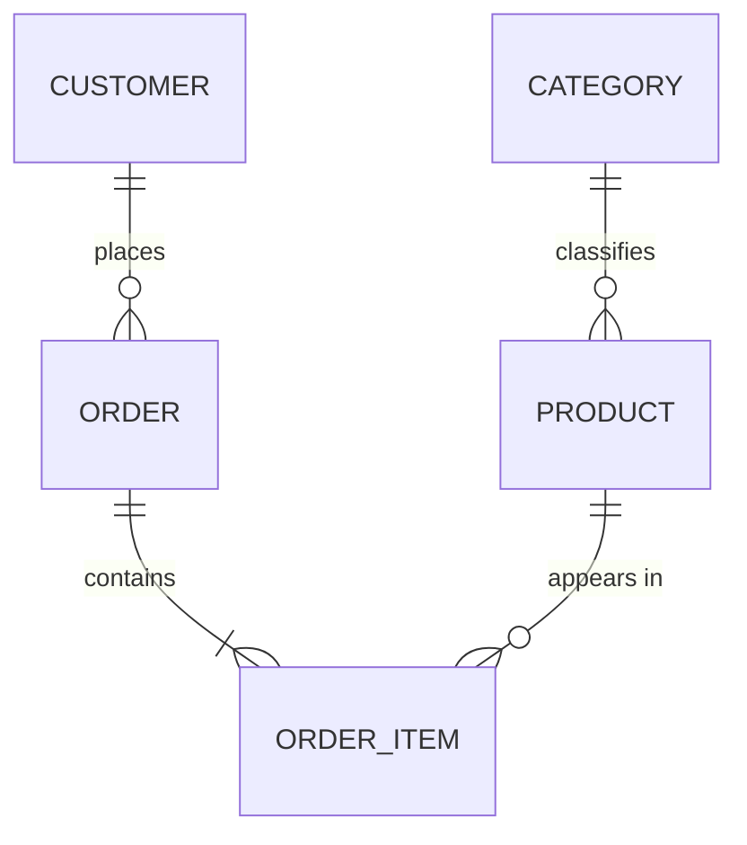

# RDBMS Data Modeling

**Requirements do not become DDL in one step.** Build the conceptual model, get it confirmed,
derive the logical model and normalize it, then — once the RDBMS is chosen — produce the
physical model and migration SQL.

Skipping the early stages is what produces schemas that churn: business concepts get missed,
and every missed concept becomes a migration later.

## When to Activate

- Designing tables for a new feature or service
- Authoring or reviewing an ERD
- Deciding a normalization, generalization, or denormalization tradeoff
- Two entities look like near-duplicates and you are unsure whether to merge them
- Planning a schema migration's target shape
- Choosing PK type, relationship cardinality, or soft-delete strategy

## Gate: How Much Rigor Does This Need?

Judge by the cost of a data error, then say which stages you are running.

| Domain | Stages |
|---|---|
| **Payments, inventory, permissions, contracts, ledgers, audit** | All three, with confirmation between each. Data errors here are expensive and often irreversible |
| Ordinary product features (content, profiles, settings, tracking) | All three, but conceptual and logical can be brief — a few lines and a compact ERD |
| Personal tool, throwaway script, single-user utility | Conceptual and logical may collapse into one short pass. Say that you compressed them |

Never skip a stage silently. If you compress, state it in one line so the user can object.

## Stage 1 — Conceptual Model

**Question: what does this system manage?**

Produce:

- The core business concepts
- The relationships between them
- The terms the *users* use, not database terms

Exclude entirely: columns, data types, keys, indexes, and the DB product.

Keep it to a few sentences or a small Mermaid diagram:

```
A customer places orders. An order contains one or more products.
A product belongs to a category.
```



While listing concepts, watch for **specialization candidates** — say the IS-A sentence and see
if it reads correctly: "is a corporate customer *a kind of* customer?" Flag those here as a
question and resolve the structure in Stage 2.

Also separate what a thing **is** from what it is **doing**. `pending`, `paid`, and `cancelled`
are states of an order; `manager` and `instructor` are roles an employee holds. Neither is a
kind of thing, and mistaking them for one here produces subtype tables that should have been a
status column or a role table.

**→ Confirmation gate.** Present the concepts and the vocabulary, then ask whether anything is
missing or named wrong. Wait for the answer. Terminology corrections are cheapest here and
most expensive after the DDL exists.

Ask specifically about what tends to be missed: lifecycle states, who owns what, whether
history must be retained, and any concept the user mentioned in passing but you did not model.

## Stage 2 — Logical Model

**Question: what is the data structure?** Still no DB product.

Produce:

- Entities and their attributes
- Primary keys and foreign keys
- Relationships with cardinality (1:1, 1:N, N:M — resolve N:M into a junction entity)
- Required (`NOT NULL`) and unique attributes
- **3NF normalization, then the BCNF check on every entity**
- **The generalization check** — IS-A, exclusivity, totality, and type vs state
- **The history question** — does anything here need its past retained, and for which purpose?

Exclude: engine-specific data types, indexes, partitioning, storage.

Use generic types at this stage — *integer*, *text*, *decimal*, *timestamp*, *boolean* — not
`bigint unsigned` or `timestamptz`. Those belong to Stage 3.

Read `references/normalization.md` for the per-normal-form rules, the BCNF check procedure,
and the denormalization bar. Emit the BCNF check block for every entity, including the ones
where the answer is "none".

### Generalization — The Test Is IS-A

Normalization and generalization pull in opposite directions and you need both. Normalization
**splits** by functional dependency; generalization asks whether several entities are *kinds
of* one thing.

**Shared attributes are a hint, never the criterion.** The test is:

> Is every subtype an instance *of* the supertype, and can it stand in anywhere the supertype
> is expected?

`Individual customer IS-A customer` reads correctly. Every corporate customer is a customer;
not every customer is a corporate customer. That one-directional substitutability is the
relationship — attribute overlap without it is just coincidence.

Answer these seven for each candidate group. Full criteria in `references/generalization.md`.

| # | Question | If the answer is… |
|---|---|---|
| 1 | Genuinely IS-A? | No → not specialization. Stop |
| 2 | Does each subtype have its own attributes, relationships, or rules? | No, only the name differs → **type column** |
| 3 | Mutually exclusive? | No, several at once → **role table** |
| 4 | Is every instance in some subtype? | Total vs partial — state which, and make partial joins tolerate a miss |
| 5 | Can the type change over time? | Frequently → **type column** or **role model**, not subtype tables |
| 6 | Is it a type, or a **state**? | State → status column + history table. **Never subtype tables** |
| 7 | Queried across all types, or one at a time? | Informs the Stage 3 physical mapping only |

**Question 6 catches the most common error.** `pending` / `paid` / `cancelled` are states of an
order, not subtypes of it. If it changes as part of normal operation, has constrained
transitions, or you want its history — it is a state. Rule of thumb: *if it changes, it is a
state or a role; if it is what the thing fundamentally is, it is a type.*

Three outcomes, only the last of which is generalization:

| Situation | Build |
|---|---|
| Same attributes, relationships, and rules — only the label differs | **Type column** with a `CHECK` on allowed values |
| Mutable responsibilities, or several held at once | **Role model** — role table keyed by the entity, with validity dates |
| Genuine IS-A with subtype-specific attributes, relationships, or constraints | **Supertype + subtypes** |

```text
customer:            customer_id, customer_type, name, joined_at   ← supertype
individual_customer: customer_id, birth_date
corporate_customer:  customer_id, business_registration_number, corporate_name
```

A subtype **shares the supertype's PK** — never mint a separate surrogate key for it. Under this
plugin's logical-FK policy that shared key is a documented reference, not a constraint, so state
the two rules the application must carry: a subtype row requires its supertype row, and an
exclusive classification permits at most one subtype row per supertype row (exactly one, if
total).

**Do not over-generalize.** A supertype where every meaningful column ended up nullable has
traded database constraints for application checks; an entity/attribute/value table
(`entity`, `attr_name`, `attr_value`) has discarded typing, constraints, and the query planner
altogether. Neither is flexibility.

Record per candidate group: the outcome (type column / role model / supertype+subtypes / kept
separate), plus exclusivity and totality when you built subtypes.

### History — Identify the Purpose Before the Structure

Three different questions get called "history", and a design answering one answers neither other:

| Kind | Answers | Structure |
|---|---|---|
| **Audit** | Who changed what, when | Audit columns, or a history table |
| **Business** | Which state changed, and **why** | State-transition history with actor + reason |
| **Valid-time** | What was in effect at a point in time | `valid_from`/`valid_to` period model |

`updated_at` answers none of them. Default for ordinary business entities is **current + history
table with full snapshots**; escalate to a valid-period model for scheduled or retroactive changes,
and to bi-temporal or event sourcing only where audit or regulatory requirements demand it.

Two rules that hold regardless of method: the current-row change and its history row are written in
**one transaction**, and there is **no physical FK (and never a `CASCADE`) from an entity to its
history** — history must survive the parent's deletion, which is exactly what an FK prevents.

Full method table, code-analysis signals, flows, and the trigger-audit exception:
`references/history-entities.md`.

**→ Confirmation gate.** Present the ERD, the normalization steps, the BCNF results, and any
generalization decisions. Ask whether the keys, cardinalities, and subtype structure match the
business rules — specifically whether anything you modeled as a type is really a state. Wait for
the answer.

## Stage 3 — Physical Model

**Gate: the target RDBMS must be confirmed before any DDL.** The dialect and the applicable
guideline both depend on it.

The logical model is what makes this choice answerable — you now know the entity count, the
relationships, and the expected volumes. If the engine is undecided, use `db-select` now (it
also covers scale tier and three-year cost). Do not pick on the user's behalf.

If the engine is decided but unstated, ask:

> The logical model is ready. Which RDBMS is this targeting?
> 1. **Aurora MySQL** (AWS, MySQL-compatible)
> 2. **MySQL Community** (8.4 LTS+)
> 3. **Aurora PostgreSQL** (AWS, PostgreSQL-compatible)
> 4. **PostgreSQL Community** (16.7+)

If repo files already answer it (`docker-compose.yml`, `alembic.ini`, `flyway.conf`,
`prisma/schema.prisma`, `DATABASE_URL` in `.env`), confirm instead of asking cold: "The repo
looks like `<DB>`. Correct?"

Then produce:

- Table and column names per `rdbms-naming` — `snake_case`, singular tables, lowercase-prefix
  constraints and indexes (`pk_` / `fk_` / `uq_` / `chk_` / `idx_` / `ftx_`). The uppercase
  `_IDX` suffix is retired; it breaks under PostgreSQL case-folding
- Engine-specific data types, and the **identifier decision** — see below
- Constraints: PK, UNIQUE, CHECK, and NOT NULL. **No `FOREIGN KEY` constraints** — see the
  rule below
- `created_at` on every table; `updated_at` on every mutable table (skip for append-only logs)
- Soft delete via `is_active` plus a composite index (MySQL) or partial index (PostgreSQL)
- Indexes driven by actual WHERE / JOIN / ORDER BY columns. Composite order is
  equality → sort → range (see `<engine>-guideline/index-and-query.md`)
- **Partitioning: recommend, do not create by default.** Analyse the queries and the retention /
  deletion code first. No time-range query and no retention policy in the code means no
  partitioning — emit it as a candidate needing volume figures instead. MySQL generates only
  `RANGE`/`RANGE COLUMNS` (a deliberate scope limit, not a technical one); PostgreSQL may use
  `RANGE`, `LIST`, or `HASH`. Always include the trailing safety partition. See
  `references/partitioning.md`
- Migration SQL, ordered, with the rollout considerations from `database-migrations`

If Stage 2 produced a supertype/subtype structure, choose its physical mapping here — the
tradeoff is about constraints and query shape, so it belongs to the physical model:

| Strategy | Fits | Watch out for |
|---|---|---|
| **Single table + discriminator** | Few types, small differences, most queries span all types | Subtype columns must be nullable, so `NOT NULL` no longer enforces them. Recover with conditional `CHECK` per type — and note these multiply with each type added |
| **Supertype table + one per subtype** | Differences are substantial and integrity matters | A join for the complete picture. Exclusivity across subtype tables is unenforced under a logical-FK policy |
| **One table per concrete subtype** | Types used entirely independently | Shared attributes duplicated; cross-type queries need `UNION ALL`; anything referencing "a customer" has nothing to point at |

**Default for ordinary business systems: supertype table + one table per subtype.** It is the
most normalized of the three. Say which you picked and why.

Under the single-table strategy, restore what nullability gave up:

```sql
ALTER TABLE customer ADD CONSTRAINT chk_customer_corporate
  CHECK (customer_type <> 'CORPORATE' OR business_registration_number IS NOT NULL);
```

Two types need two such constraints, five need five, and each new type edits the existing set —
weigh that before choosing this strategy for a classification you expect to extend.

Finally, propose sample data and a constraint test — the smallest inserts that prove the keys,
uniqueness, check constraints, and any subtype rules behave as intended.

### Database Internal Routines

Procedures, triggers, and events **default to unused** — business logic belongs in the application,
where it is version controlled, testable, and visible in a stack trace. Three categories, split by what
the routine *does*, not what kind of object it is:

| Category | Verdict |
|---|---|
| **Infrequent operational utilities** — partition creation/rotation, retention purge, statistics refresh, consistency-check queries, materialized view refresh | **Allowed.** No business semantics, scheduled and low duty cycle, idempotent, version controlled, monitored. Prefer an external scheduler where one exists |
| **Audit trigger** | **Narrow exception.** Only to capture writes that bypass the application; audit table only, no business logic. See `references/history-entities.md` |
| **Business logic** — maintaining a denormalized value, setting `updated_at`, enforcing a state transition, workflow in a procedure | **Prohibited.** It belongs in the application transaction |

The tempting case is a trigger maintaining a denormalized column. It does not qualify: it runs on every
write, and keeping a derived business value correct *is* business logic. Full policy and the inventory
queries for reviewing an existing schema: `references/db-internal-routines.md`.

### Identifier Decision: UID vs Primary Key

Separate the **logical identifier** from the **physical primary key**, and choose each against the
engine's storage model. Full criteria in `references/identifier-selection.md`.

Universal, both engines: a PK is `NOT NULL`, `UNIQUE`, and **immutable**. Business identifiers that
can change or be exposed (email, national ID, business registration number) go in a `UNIQUE`
constraint, never the PK. Never a raw timestamp alone as a PK — concurrent creation collides and
clocks run backwards. Never `char(36)` for a UUID. **A UUID is not a credential** — possession is
never authorization.

| Situation | MySQL / InnoDB | PostgreSQL |
|---|---|---|
| Single DB, ordinary table | `bigint unsigned AUTO_INCREMENT` | `bigint GENERATED ALWAYS AS IDENTITY`, or UUIDv7 |
| Write-heavy | Sequential integer first | `IDENTITY` or UUIDv7 — not v4 |
| Generated on multiple nodes | UUIDv7 as `binary(16)`, or a distributed integer ID | native `uuid` with UUIDv7 |
| Exposed externally | Internal integer PK + public UID column | UUID PK, or integer PK + public UID |
| Wide natural or composite key | Split out as `UNIQUE` | Split out as `UNIQUE` |

**Why the engines differ.** InnoDB uses the PK as its clustering index *and* copies the PK value
into every secondary index — so PK width and ordering are storage decisions, and a random UUIDv4 PK
fragments the table and inflates every index. PostgreSQL stores rows in a heap, so a UUID PK costs
much less — but **not nothing**, because index locality still applies to the PK's own B-tree.

Two engine specifics that are easy to get wrong:

- MySQL: `UUID_TO_BIN(v, 1)`'s swap flag exists for **UUIDv1** (what MySQL's `UUID()` returns).
  **Do not apply it to a UUIDv7** — v7 is already time-ordered and swapping destroys that.
- PostgreSQL: `uuidv7()` is built in from **PG 18**. On 16/17 generate v7 in the application;
  `gen_random_uuid()` is **v4**.

### Foreign Keys — The Policy Splits by Engine

Full criteria in `references/foreign-keys.md`.

| | MySQL / InnoDB | PostgreSQL |
|---|---|---|
| Physical `FOREIGN KEY` | **Not created** | **Allowed by default — created when the six conditions are met** |
| Integrity owner | The application | The database, once the constraint is valid |
| Referencing-column index | **Mandatory, by hand** | Created unless an existing index already leads with it |

**Why they differ.** InnoDB cannot put a foreign key on a partitioned table in either direction —
and this plugin treats log and history tables as partitioning candidates by default, so an FK today
is a blocked partition tomorrow. Add the parent-index I/O on every child write, shared locks on the
parent row that serialize unrelated child writes, and the special handling `pt-online-schema-change`
and `gh-ost` need, and the constraint costs more than it provides. PostgreSQL has none of the
clustering penalty, supports FKs on partitioned tables, and can validate a large table without
holding a long exclusive lock.

**MySQL — the index consequence is the trap.** InnoDB's automatic child index comes *from* the FK
constraint. Remove the constraint and the index goes with it, silently. So an explicit index on the
referencing column is **mandatory and manual** — skip only when an existing composite index already
**leads** with that column.

Every **logical** FK (all of MySQL, and PostgreSQL relationships where a gate failed) carries four
compensating controls:

1. The reference in a `COMMENT` — `logical FK: parent_table.parent_column`
2. The index above
3. A named **integrity owner** — which service or module guarantees it on the write path
4. A scheduled orphan-detection query

**PostgreSQL — six gates.** Allowed by default is not always create. Create the constraint only when
all six hold; a failing gate means fix it first, or fall back to a logical FK and say why.

| # | Gate |
|---|---|
| 1 | Parent column is a **PK or UNIQUE** |
| 2 | Referencing column is **indexed** — create it in the same migration |
| 3 | No **redundant** index introduced (reuse an existing leading-column index) |
| 4 | `CASCADE` only where the child's **lifecycle genuinely depends** on the parent |
| 5 | **`NOT DEFERRABLE`** unless a circular reference must resolve in one transaction |
| 6 | Large existing table: **`NOT VALID`** first, then `VALIDATE CONSTRAINT` separately |

A constraint left `NOT VALID` never checked the existing rows — until `VALIDATE CONSTRAINT` succeeds,
treat the reference as a logical FK and run the orphan query.

**Both engines**: the reference must target a **PK or UNIQUE** column. This holds for a logical FK
too — a documented reference to a non-unique column is ambiguous by construction, and the orphan
query cannot be written correctly against it.

If multiple writers exist (batch, admin, external integrations), the integrity owner must be a
shared layer all of them pass through. If no such layer can exist, say so in the design — do not
resolve it by adding the constraint back.

### DB-to-Guideline Mapping

| Target | Apply | Key rules |
|---|---|---|
| Aurora MySQL / MySQL Community | `mysql-guideline` | InnoDB + utf8mb4, `bigint unsigned AUTO_INCREMENT`, `datetime` + `ON UPDATE CURRENT_TIMESTAMP`, `json`, logical FKs |
| Aurora PostgreSQL / PostgreSQL Community | `postgres-guideline` | `GENERATED ALWAYS AS IDENTITY`, `timestamptz`, `boolean`, `jsonb`, schema separation (`app`/`log`/`ref`), partial indexes, RLS |

Aurora variants follow the base guideline plus:

- **Aurora MySQL** — Writer/Reader split; avoid excessive indexes that slow writes; assume
  `FOR UPDATE` runs against the Writer endpoint
- **Aurora PostgreSQL** — Extension availability is limited (`pg_partman`, `pg_cron` may be
  restricted); plan scripted partitioning as a fallback
- **Both** — Size pools against RDS Proxy or app-side pools; account for IAM authentication
  when designing DB users; treat log tables as candidates for S3 Export or partition-and-drop

## Normalization Policy

**3NF is the requirement. BCNF is a check, then an option. Denormalization needs a
measurement.** Full rules in `references/normalization.md`.

| Level | Status | Rule |
|---|---|---|
| 1NF → 3NF | **Required** | The baseline for any OLTP schema. Not negotiable |
| BCNF | **Checked, then optional** | Test every table for a determinant that is not a superkey. Decompose when that determinant can actually produce an update, insert, or delete anomaly |
| Stay at 3NF | **Permitted exception** | When BCNF decomposition cannot preserve functional dependencies, or explodes the join count for normal queries. Record which one applied |
| Denormalization | **Requires evidence** | Only after a performance problem has been *measured*. Record the evidence and the synchronization mechanism |

Normalization and ACID solve different problems and neither substitutes for the other:

- **ACID** is how a transaction handles data safely — atomicity, consistency, isolation, durability.
- **Normalization** is how the schema avoids redundancy and update anomalies.

A fully normalized schema on a non-transactional store still corrupts under concurrent writes;
a transactional store with a denormalized schema still drifts out of sync. Assume an
ACID-capable engine (both MySQL/InnoDB and PostgreSQL are) and normalize on top of it.

Do not denormalize while designing something new. Denormalization answers a measured problem in a
running system — with no measurement, the deliverable is the normalized design. When there *is* a
measurement, `references/denormalization.md` has the seven apply-conditions, the cheaper alternatives
to rule out first, and the consistency-check and rebuild requirements every duplicate must ship with.

One distinction that trips people up: **a snapshot of a business fact is not denormalization.** The
price on an order line at purchase time is the transaction's own data, not a cached copy of the product
price. Ask whether the value should follow the source when the source changes — no means it is business
source data and needs no synchronization.

## Deliverable Format

One section per stage, delivered in order, each stopping at its gate.

```
STAGE 1 — Conceptual model
  Rigor:      all three stages | compressed (and why)
  Concepts:   <business concepts and the user-facing terms>
  Relations:  <text or Mermaid>
  → Confirm: anything missing or misnamed?

STAGE 2 — Logical model
  ERD:            <entities, attributes, keys, cardinality>
  Required/unique: <NOT NULL and UNIQUE attributes>
  Normalization:  1NF result / 2NF violations + resolution / 3NF violations + resolution
  BCNF check:     one block per entity — FDs, violation or "none", decision, reason
  Generalization: per candidate group — IS-A verdict, then outcome (type column | role model |
                  supertype+subtypes | kept separate). If subtypes: exclusive/overlapping,
                  total/partial, and whether the type can change
  → Confirm: do the keys, cardinalities, and subtype structure match the business rules —
             and is anything modeled as a type actually a state?

STAGE 3 — Physical model
  Target DB:      <name and version, and how it was confirmed>
  Subtype mapping: <strategy and why — only if Stage 2 produced a supertype>
  DDL:            <CREATE TABLE + constraints in the correct dialect>
  Indexes:        <with the query each one serves>
  Partitioning:   <decision for log/history tables>
  FK decisions:   <per reference — physical (PG, six conditions verified) | logical (COMMENT,
                  index, integrity owner, orphan check query)>
  Migration:      <ordered SQL + rollout notes>
  Sample data:    <smallest inserts that exercise the constraints>
  Checklist:      <verified below>
```

## Checklist

- [ ] Rigor level stated; any compressed stage called out explicitly
- [ ] Stage 1 confirmed by the user before Stage 2 began
- [ ] Stage 2 confirmed by the user before any DDL was written
- [ ] Target DB confirmed before Stage 3
- [ ] Logical model used generic types, not engine-specific ones
- [ ] 1NF: no repeating groups, no multi-value columns
- [ ] 2NF: no partial dependencies on composite PKs
- [ ] 3NF: no transitive dependencies between non-key columns
- [ ] BCNF check run on **every** entity, with the result stated (including "none")
- [ ] Each BCNF violation either decomposed, or kept at 3NF with the exception named
      (dependency preservation or join cost)
- [ ] Generalization checked per candidate group, with the IS-A test applied — not attribute overlap
- [ ] Nothing modeled as a subtype that is actually a **state** (changes in normal operation,
      constrained transitions, history wanted)
- [ ] Overlapping capabilities modeled as a role table, not a type code
- [ ] Classifications that differ only in name use a type column, not subtype tables
- [ ] For each subtype structure: exclusivity, totality, and type mutability stated
- [ ] Subtype PK **is** the supertype PK — no separate surrogate key on the subtype
- [ ] The two integrity rules a logical-FK policy leaves to the application are stated
- [ ] No supertype where every meaningful column ended up nullable; no entity/attribute/value table
- [ ] Subtype physical mapping chosen and justified, with conditional `CHECK` constraints
      recovering any `NOT NULL` lost to the single-table strategy
- [ ] No denormalization without a measurement, the alternatives already tried, and a stated
      synchronization mechanism
- [ ] Every denormalized column carries its rationale and sync mechanism in a `COMMENT`
- [ ] PK type matches expected row count (tinyint / smallint / int / bigint)
- [ ] MySQL: **no `FOREIGN KEY` constraints in the DDL**; PostgreSQL: each physical FK satisfies
      all six conditions, or was deliberately left logical with the reason stated
- [ ] Every logical FK has all four: `COMMENT`, index on the referencing column, named integrity
      owner, scheduled orphan check
- [ ] Every reference targets a PK or UNIQUE column — logical ones included
- [ ] No PostgreSQL constraint left `NOT VALID` without a validation step
- [ ] `created_at` on every table; `updated_at` on every mutable table
- [ ] Soft-delete tables use `is_active` with the right index strategy per engine
- [ ] Naming follows `rdbms-naming`: snake_case, singular tables, lowercase-prefix
      indexes/constraints, boolean `is_`/`has_`, time columns `created_at`/`updated_at`
- [ ] Engine-correct types (MySQL: `datetime`, `json`, `tinyint(1)`; PostgreSQL:
      `timestamptz`, `jsonb`, `boolean`)
- [ ] Partitioning recommended from evidence in the code, not from expected growth — with
      confidence stated and missing volume figures named
- [ ] If partitioned: partition key `NOT NULL` and present in the main `WHERE` predicates;
      every PK/UNIQUE contains it (MySQL); trailing safety partition created with its
      alert-and-move rules stated
- [ ] Composite index order: equality → sort → range
- [ ] History purpose identified (audit / business / valid-time) before any history structure, or
      stated that none is needed
- [ ] If history exists: `(entity_id, version)` unique, append-only, written in the same
      transaction as the current row, no FK or `CASCADE` from the entity, retention period named
- [ ] Personal data in snapshots has a stated retention period and purge path
- [ ] Sample data and constraint test proposed

## Anti-Patterns (Fix on Sight)

| Anti-pattern | Replacement |
|---|---|
| Requirements straight to `CREATE TABLE` | Conceptual → logical → physical, with gates |
| Engine types in the logical model | Generic types until Stage 3 |
| Generalizing on attribute overlap with no IS-A relationship | Keep them separate |
| Subtypes for `pending` / `paid` / `cancelled` | Status column + history table — these are states |
| Subtypes for overlapping capabilities (manager *and* instructor) | Role table with validity dates |
| Subtypes that differ only in name | Type column with a `CHECK` on allowed values |
| Supertype where every meaningful column is nullable | Split into subtype tables, or conditional `CHECK` per type |
| Separate surrogate key on a subtype row | Subtype PK **is** the supertype PK |
| Entity/attribute/value table | Real columns; `jsonb`/`json` only for non-queried config |
| Multi-value storage via CSV or pipe delimiters | Separate N:M table |
| `'Y'` / `'N'` string flags | MySQL `tinyint(1)` / PostgreSQL `boolean` |
| `timestamp` without timezone (PostgreSQL) | `timestamptz` |
| Habitual `varchar(255)` (PostgreSQL) | `text` |
| Natural key as PK when the key changes | Surrogate PK + `UNIQUE` constraint |
| `FOREIGN KEY` constraint on MySQL/InnoDB | Logical FK: `COMMENT` + index + named integrity owner + orphan check |
| Dropping a MySQL FK without first creating the index | The auto-created child index goes with it — create the explicit index first |
| `ON DELETE CASCADE` on a high-fan-out parent | `RESTRICT` + explicit deletion, or a bounded batch job |
| PostgreSQL FK with an unindexed referencing column | Create the index — PostgreSQL never auto-creates it |
| PostgreSQL constraint left `NOT VALID` | `VALIDATE CONSTRAINT`; until then it is a logical FK |
| Reference to a non-unique column | Target a PK or UNIQUE — otherwise the reference is ambiguous |
| Logical FK with no orphan check | Violations accumulate silently — schedule the detection query |
| `updated_at` used as history | Pick a real method — audit columns answer nothing about what changed |
| Current row and history written in separate transactions | One transaction, or the history lies |
| `ON DELETE CASCADE` from entity to its history | History must outlive the row it describes |
| Generic JSON audit log replacing a business history entity | No schema, no reason code, unplannable queries |
| PII in snapshots with no retention limit | Name the retention period and the purge path |
| Standalone `is_active` index | Composite index (MySQL) / partial index (PostgreSQL) |
| `OFFSET` pagination on large log tables | Cursor / keyset pagination |
| An index on every column | Minimal indexes driven by real query patterns |

## Related

- `db-select` — pick the engine, scale tier, and cost position at the Stage 3 gate
- `rdbms-naming` — naming and data-type conventions (single source of truth)
- `references/normalization.md` — per-normal-form rules, BCNF procedure, denormalization bar
- `references/generalization.md` — IS-A and substitutability, the seven questions in full,
  type column vs role model vs supertype, identifier inheritance, physical mapping
- `references/identifier-selection.md` — UID vs PK, per-engine storage model, UUIDv4/v7,
  the `UUID_TO_BIN` swap-flag trap, PG 18 `uuidv7()`
- `references/foreign-keys.md` — engine split, why the referencing index is mandatory on MySQL once
  the constraint is gone, the six PostgreSQL conditions, reference-target rule
- `references/partitioning.md` — code-based recommendation policy, recommend/exclude conditions,
  MySQL RANGE-only scope decision, safety-partition operating rules
- `references/history-entities.md` — audit vs business vs valid-time history, the eight methods and
  when each applies, standard history entity, transaction flows, the trigger-audit exception
- `references/denormalization.md` — the measured-problem bar, eight methods, cheaper alternatives to
  try first, synchronization mechanisms, the seven apply-conditions, consistency check and rebuild
- `references/db-internal-routines.md` — procedures/triggers/events: sanctioned operational
  utilities, the narrow audit-trigger exception, and business logic that stays in the application
- `mysql-guideline` — and its `mysql-guideline/schema-design.md`,
  `mysql-guideline/index-and-query.md`, `mysql-guideline/partitioning.md`,
  `mysql-guideline/operations.md`
- `postgres-guideline` — and its `postgres-guideline/schema-design.md`,
  `postgres-guideline/index-and-query.md`, `postgres-guideline/partitioning.md`
- `rdbms-review` — review an existing schema or query rather than designing a new one
- `database-migrations` — rolling the design out safely against a live database

---

**Remember**: conceptual model first and confirmed, then the logical model normalized to 3NF
with the BCNF check run on every entity, and only then the physical model in a confirmed
dialect. Denormalize only against a measurement, with the synchronization mechanism written
down.
