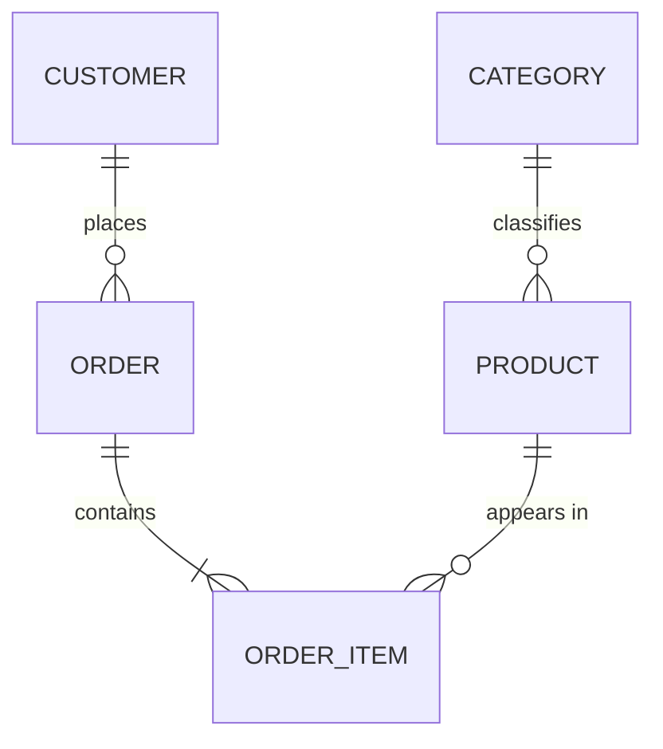

# RDBMS Data Modeling

**Requirements do not become DDL in one step.** Build the conceptual model, get it confirmed,
derive the logical model and normalize it, then — once the RDBMS is chosen — produce the
physical model and migration SQL.

Skipping the early stages is what produces schemas that churn: business concepts get missed,
and every missed concept becomes a migration later.

## When to Activate

- Designing tables for a new feature or service
- Authoring or reviewing an ERD
- Deciding a normalization, generalization, or denormalization tradeoff
- Two entities look like near-duplicates and you are unsure whether to merge them
- Planning a schema migration's target shape
- Choosing PK type, relationship cardinality, or soft-delete strategy

## Gate: How Much Rigor Does This Need?

Judge by the cost of a data error, then say which stages you are running.

| Domain | Stages |
|---|---|
| **Payments, inventory, permissions, contracts, ledgers, audit** | All three, with confirmation between each. Data errors here are expensive and often irreversible |
| Ordinary product features (content, profiles, settings, tracking) | All three, but conceptual and logical can be brief — a few lines and a compact ERD |
| Personal tool, throwaway script, single-user utility | Conceptual and logical may collapse into one short pass. Say that you compressed them |

Never skip a stage silently. If you compress, state it in one line so the user can object.

## Stage 1 — Conceptual Model

**Question: what does this system manage?**

Produce:

- The core business concepts
- The relationships between them
- The terms the *users* use, not database terms

Exclude entirely: columns, data types, keys, indexes, and the DB product.

Keep it to a few sentences or a small Mermaid diagram:

```
A customer places orders. An order contains one or more products.
A product belongs to a category.
```



While listing concepts, watch for **specialization candidates** — say the IS-A sentence and see
if it reads correctly: "is a corporate customer *a kind of* customer?" Flag those here as a
question and resolve the structure in Stage 2.

Also separate what a thing **is** from what it is **doing**. `pending`, `paid`, and `cancelled`
are states of an order; `manager` and `instructor` are roles an employee holds. Neither is a
kind of thing, and mistaking them for one here produces subtype tables that should have been a
status column or a role table.

**→ Confirmation gate.** Present the concepts and the vocabulary, then ask whether anything is
missing or named wrong. Wait for the answer. Terminology corrections are cheapest here and
most expensive after the DDL exists.

Ask specifically about what tends to be missed: lifecycle states, who owns what, whether
history must be retained, and any concept the user mentioned in passing but you did not model.

## Stage 2 — Logical Model

**Question: what is the data structure?** Still no DB product.

Produce:

- Entities and their attributes
- Primary keys and foreign keys
- Relationships with cardinality (1:1, 1:N, N:M — resolve N:M into a junction entity)
- Required (`NOT NULL`) and unique attributes
- **3NF normalization, then the BCNF check on every entity**
- **The generalization check** — IS-A, exclusivity, totality, and type vs state
- **The history question** — does anything here need its past retained, and for which purpose?

Exclude: engine-specific data types, indexes, partitioning, storage.

Use generic types at this stage — *integer*, *text*, *decimal*, *timestamp*, *boolean* — not
`bigint unsigned` or `timestamptz`. Those belong to Stage 3.

Read `references/normalization.md` for the per-normal-form rules, the BCNF check procedure,
and the denormalization bar. Emit the BCNF check block for every entity, including the ones
where the answer is "none".

| Level | Status |
|---|---|
| 1NF → 3NF | **Required** — the OLTP baseline, not negotiable |
| BCNF | **Checked on every entity**, decomposed when a non-superkey determinant causes a real anomaly; staying at 3NF is allowed for dependency preservation or join cost — say which |
| Denormalization | **Physical-model only, against a measurement** — see `references/denormalization.md`. A snapshot of a business fact (order-time price) is not denormalization |

ACID and normalization are separate concerns — one keeps transactions safe, the other keeps the
schema from drifting; neither substitutes for the other. Both engines here are ACID-capable.

### Generalization — The Test Is IS-A

Normalization and generalization pull in opposite directions and you need both. Normalization
**splits** by functional dependency; generalization asks whether several entities are *kinds
of* one thing.

**Shared attributes are a hint, never the criterion.** The test is:

> Is every subtype an instance *of* the supertype, and can it stand in anywhere the supertype
> is expected?

`Individual customer IS-A customer` reads correctly. Every corporate customer is a customer;
not every customer is a corporate customer. That one-directional substitutability is the
relationship — attribute overlap without it is just coincidence.

Answer these seven for each candidate group. Full criteria in `references/generalization.md`.

| # | Question | If the answer is… |
|---|---|---|
| 1 | Genuinely IS-A? | No → not specialization. Stop |
| 2 | Does each subtype have its own attributes, relationships, or rules? | No, only the name differs → **type column** |
| 3 | Mutually exclusive? | No, several at once → **role table** |
| 4 | Is every instance in some subtype? | Total vs partial — state which, and make partial joins tolerate a miss |
| 5 | Can the type change over time? | Frequently → **type column** or **role model**, not subtype tables |
| 6 | Is it a type, or a **state**? | State → status column + history table. **Never subtype tables** |
| 7 | Queried across all types, or one at a time? | Informs the Stage 3 physical mapping only |

**Question 6 catches the most common error.** `pending` / `paid` / `cancelled` are states of an
order, not subtypes of it. If it changes as part of normal operation, has constrained
transitions, or you want its history — it is a state. Rule of thumb: *if it changes, it is a
state or a role; if it is what the thing fundamentally is, it is a type.*

Three outcomes, only the last of which is generalization:

| Situation | Build |
|---|---|
| Same attributes, relationships, and rules — only the label differs | **Type column** with a `CHECK` on allowed values |
| Mutable responsibilities, or several held at once | **Role model** — role table keyed by the entity, with validity dates |
| Genuine IS-A with subtype-specific attributes, relationships, or constraints | **Supertype + subtypes** |

```text
customer:            customer_id, customer_type, name, joined_at   ← supertype
individual_customer: customer_id, birth_date
corporate_customer:  customer_id, business_registration_number, corporate_name
```

A subtype **shares the supertype's PK** — never mint a separate surrogate key for it. Two
integrity rules attach to it: a subtype row requires its supertype row (FK-enforceable on
PostgreSQL, application-carried on MySQL), and an exclusive classification permits at most one
subtype row per supertype row — exactly one, if total — which **no FK can enforce on either
engine** and always needs an application rule plus a detection query.

**Do not over-generalize.** A supertype where every meaningful column ended up nullable has
traded database constraints for application checks; an entity/attribute/value table
(`entity`, `attr_name`, `attr_value`) has discarded typing, constraints, and the query planner
altogether. Neither is flexibility.

Record per candidate group: the outcome (type column / role model / supertype+subtypes / kept
separate), plus exclusivity and totality when you built subtypes.

### History — Identify the Purpose Before the Structure

Three different questions get called "history", and a design answering one answers neither other:

| Kind | Answers | Structure |
|---|---|---|
| **Audit** | Who changed what, when | Audit columns, or a history table |
| **Business** | Which state changed, and **why** | State-transition history with actor + reason |
| **Valid-time** | What was in effect at a point in time | `valid_from`/`valid_to` period model |

`updated_at` answers none of them. Default for ordinary business entities is **current + history
table with full snapshots**; escalate to a valid-period model for scheduled or retroactive changes,
and to bi-temporal or event sourcing only where audit or regulatory requirements demand it.

Two rules that hold regardless of method: the current-row change and its history row are written in
**one transaction**, and there is **no physical FK (and never a `CASCADE`) from an entity to its
history** — history must survive the parent's deletion, which is exactly what an FK prevents.

Full method table, code-analysis signals, flows, and the trigger-audit exception:
`references/history-entities.md`.

**→ Confirmation gate.** Present the ERD, the normalization steps, the BCNF results, and any
generalization decisions. Ask whether the keys, cardinalities, and subtype structure match the
business rules — specifically whether anything you modeled as a type is really a state. Wait for
the answer.

## Stage 3 — Physical Model

**Gate: the target RDBMS must be confirmed before any DDL.** The dialect and the applicable
guideline both depend on it.

The logical model is what makes this choice answerable — you now know the entity count, the
relationships, and the expected volumes. If the engine is undecided, use `db-select` now (it
also covers scale tier and three-year cost). Do not pick on the user's behalf.

If the engine is decided but unstated, ask:

> The logical model is ready. Which RDBMS is this targeting?
> 1. **Aurora MySQL** (AWS, MySQL-compatible)
> 2. **MySQL Community** (8.4 LTS+)
> 3. **Aurora PostgreSQL** (AWS, PostgreSQL-compatible)
> 4. **PostgreSQL Community** (16.7+)
> 5. **SQLite** (3.37+, embedded / local / Tier 0)

If repo files already answer it (`docker-compose.yml`, `alembic.ini`, `flyway.conf`,
`prisma/schema.prisma`, `DATABASE_URL` in `.env`), confirm instead of asking cold: "The repo
looks like `<DB>`. Correct?"

### DB-to-Guideline Mapping

| Target | Apply | Key rules |
|---|---|---|
| Aurora MySQL / MySQL Community | `mysql-guideline` | InnoDB + utf8mb4, `bigint unsigned AUTO_INCREMENT`, `datetime` + `ON UPDATE CURRENT_TIMESTAMP`, `json`, logical FKs |
| Aurora PostgreSQL / PostgreSQL Community | `postgres-guideline` | `GENERATED ALWAYS AS IDENTITY`, `timestamptz`, `boolean`, `jsonb`, schema separation (`app`/`log`/`ref`), partial indexes, RLS |
| SQLite | `sqlite-guideline` | `STRICT` tables, PRAGMA baseline (`foreign_keys=ON`, WAL), `INTEGER PRIMARY KEY` rowid, integer-cents money, physical FKs allowed, no partitioning |

Aurora variants follow the base guideline plus:

- **Aurora MySQL** — Writer/Reader split; avoid excessive indexes that slow writes; assume
  `FOR UPDATE` runs against the Writer endpoint
- **Aurora PostgreSQL** — Extension availability is limited (`pg_partman`, `pg_cron` may be
  restricted); plan scripted partitioning as a fallback
- **Both** — Size pools against RDS Proxy or app-side pools; account for IAM authentication
  when designing DB roles; treat log tables as candidates for S3 Export or partition-and-drop


Then produce:

- Table and column names per `rdbms-naming` — `snake_case`, singular tables, lowercase-prefix
  constraints and indexes (`pk_` / `fk_` / `uq_` / `chk_` / `idx_` / `fts_`). The uppercase
  `_IDX` suffix is retired; it breaks under PostgreSQL case-folding
- Engine-specific data types, and the **identifier decision** — see below
- Constraints: PK, UNIQUE, CHECK, and NOT NULL. Foreign keys follow the **engine-split policy**
  below — none on MySQL; on PostgreSQL only through the six gates
- `created_at` on every table; `updated_at` on every mutable table (skip for append-only logs)
- Soft delete via `is_active` plus a composite index (MySQL) or partial index (PostgreSQL)
- **Indexes from evidence, not from guesses.** Composite draft: equality first, then sort columns
  (when the query needs the index's ordering) or the first selective range — one range column ends
  seek-and-order for everything after it. Confirm against the real plan. Every index costs write throughput, storage, backup
  size, and buffer-pool space forever — emit the justifying query, the column-order reason, and the
  rollback with each one. With no plan or metrics available, say `needs measurement` rather than
  estimating an improvement. See `references/index-design.md` and
  `<engine>-guideline/index-and-query.md`
- **Views and materialized views** — a plain view is reuse, security, and abstraction; it is **not** a
  performance cache. Acceleration means a PostgreSQL materialized view or a MySQL summary table, which
  is a denormalization and inherits its requirements (source of truth, sync, rebuild). Never make one
  the source of truth for balances, inventory, or permissions. See
  `references/views-and-materialized-views.md`
- **Partitioning: recommend, do not create by default.** Analyse the queries and the retention /
  deletion code first. No time-range query and no retention policy in the code means no
  partitioning — emit it as a candidate needing volume figures instead. MySQL generates only
  `RANGE`/`RANGE COLUMNS` (a deliberate scope limit, not a technical one); PostgreSQL may use
  `RANGE`, `LIST`, or `HASH`. Always include the trailing safety partition. See
  `references/partitioning.md`
- Migration SQL, ordered, with the rollout considerations from `database-migrations`

If Stage 2 produced a supertype/subtype structure, choose its physical mapping here — the
tradeoff is about constraints and query shape, so it belongs to the physical model:

| Strategy | Fits | Watch out for |
|---|---|---|
| **Single table + discriminator** | Few types, small differences, most queries span all types | Subtype columns must be nullable, so `NOT NULL` no longer enforces them. Recover with conditional `CHECK` per type — and note these multiply with each type added |
| **Supertype table + one per subtype** | Differences are substantial and integrity matters | A join for the complete picture. Exclusivity across subtype tables is not FK-enforceable on either engine — application rule + detection query |
| **One table per concrete subtype** | Types used entirely independently | Shared attributes duplicated; cross-type queries need `UNION ALL`; anything referencing "a customer" has nothing to point at |

**Default for ordinary business systems: supertype table + one table per subtype.** It is the
most normalized of the three. Say which you picked and why.

Under the single-table strategy, restore what nullability gave up:

```sql
ALTER TABLE customer ADD CONSTRAINT chk_customer_corporate
  CHECK (customer_type <> 'CORPORATE' OR business_registration_number IS NOT NULL);
```

Two types need two such constraints, five need five, and each new type edits the existing set —
weigh that before choosing this strategy for a classification you expect to extend.

Finally, propose sample data and a constraint test — the smallest inserts that prove the keys,
uniqueness, check constraints, and any subtype rules behave as intended.

### Database Internal Routines

Procedures, triggers, and events **default to unused** — business logic belongs in the application,
where it is version controlled, testable, and visible in a stack trace. Three categories, split by what
the routine *does*, not what kind of object it is:

| Category | Verdict |
|---|---|
| **Infrequent operational utilities** — partition creation/rotation, retention purge, statistics refresh, consistency-check queries, materialized view refresh | **Allowed.** No business semantics, scheduled and low duty cycle, idempotent, version controlled, monitored. Prefer an external scheduler where one exists |
| **Audit trigger** | **Narrow exception.** Only to capture writes that bypass the application; audit table only, no business logic. See `references/history-entities.md` |
| **Business logic** — maintaining a denormalized value, setting `updated_at`, enforcing a state transition, workflow in a procedure | **Prohibited.** It belongs in the application transaction |

The tempting case is a trigger maintaining a denormalized column. It does not qualify: it runs on every
write, and keeping a derived business value correct *is* business logic. Full policy and the inventory
queries for reviewing an existing schema: `references/db-internal-routines.md`.

### Identifier Decision: UID vs Primary Key

A PK is `NOT NULL`, `UNIQUE`, **immutable**. Mutable or exposable business identifiers (email,
national ID) go in a `UNIQUE` constraint, never the PK. Never a raw timestamp as PK, never
`char(36)` for a UUID, and **a UUID is not a credential**. Full criteria and the reasoning:
`references/identifier-selection.md`.

| Situation | MySQL / InnoDB | PostgreSQL |
|---|---|---|
| Single DB, **entity** table (one row per real thing — `member`, `product`) | `int unsigned AUTO_INCREMENT` — 4.2B, and the real world caps the entity count. Record what caps it | `int GENERATED ALWAYS AS IDENTITY` |
| Single DB, **event/log** table (one row per occurrence — `*_log`, `*_history`, IoT, audit) | **`bigint unsigned AUTO_INCREMENT`** — rows = rate × time, no cap | **`bigint GENERATED ALWAYS AS IDENTITY`** |
| Write-heavy | Sequential integer first | `IDENTITY` or UUIDv7 — not v4 |
| Generated on multiple nodes | UUIDv7 as `binary(16)` | native `uuid` with UUIDv7 |
| Exposed externally | Internal integer PK + public UID column | UUID PK, or integer PK + public UID |
| Wide natural or composite key | Split out as `UNIQUE` | Split out as `UNIQUE` |

Size the integer by **what makes the row count grow**, not by today's row count — and get it right
now, because changing a PK's type later needs `ALGORITHM=COPY` on MySQL (full rebuild plus every
secondary index) or a table rewrite under `ACCESS EXCLUSIVE` on PostgreSQL. Note that retention
policies and partition drops reclaim storage but **not** ID range: sequences never reuse values.
An "entity" that turns out to be machine-generated (per-device rows, ad impressions) is an event
table wearing an entity name.

Why the engines differ: InnoDB clusters on the PK and copies it into every secondary index; PostgreSQL
heaps rows, so a UUID PK costs less — but not nothing. Two traps: `UUID_TO_BIN(v, 1)`'s swap flag
is **UUIDv1-only** (swapping a v7 destroys its ordering), and `uuidv7()` is built in only from
**PG 18** — `gen_random_uuid()` is v4.

### Foreign Keys — The Policy Splits by Engine

Full criteria, the SQL, and the exception paths: `references/foreign-keys.md`.

| | MySQL / InnoDB | PostgreSQL |
|---|---|---|
| Physical `FOREIGN KEY` | **Not created** | **Allowed — created only through the six gates** |
| Integrity owner | The application | The database, once the constraint is valid |
| Referencing-column index | **Mandatory, by hand** | Created unless an existing index already leads with it |

Why: InnoDB cannot put an FK on a partitioned table (and log/history tables are the usual
partitioning candidates), FK checks take parent-row locks that make hot-parent key updates and
child writes stall each other, and online DDL tools need special handling. PostgreSQL has none of the clustering penalty and validates large tables via
`NOT VALID` → `VALIDATE CONSTRAINT`.

(SQLite targets differ again: physical FKs are fine there but enforcement is per-connection —
`sqlite-guideline` owns that policy.)

**The MySQL trap**: under a no-FK policy nothing ever auto-creates the child index, so the
referencing-column index is deliberate and manual. (On inherited schemas, dropping an FK leaves
its auto-created index behind under an auto-generated name — verify with `SHOW INDEX` and rename
it before a cleanup job mistakes it for dead weight.)

Every **logical** FK carries four controls: `COMMENT`, the index, a named integrity owner, a
scheduled orphan-detection query. The six PostgreSQL gates: ① parent is PK/UNIQUE ② referencing
column indexed ③ no redundant index ④ `CASCADE` only for genuine lifecycle dependency
⑤ `NOT DEFERRABLE` ⑥ large tables via `NOT VALID` then `VALIDATE`. A failing gate → fix it, or
fall back to a logical FK and say why. Both engines: every reference — logical included —
targets a **PK or UNIQUE** column.

## Deliverable Format

One section per stage, delivered in order, each stopping at its gate.

```
STAGE 1 — Conceptual model
  Rigor:      all three stages | compressed (and why)
  Concepts:   <business concepts and the user-facing terms>
  Relations:  <text or Mermaid>
  → Confirm: anything missing or misnamed?

STAGE 2 — Logical model
  ERD:            <entities, attributes, keys, cardinality>
  Required/unique: <NOT NULL and UNIQUE attributes>
  Normalization:  1NF result / 2NF violations + resolution / 3NF violations + resolution
  BCNF check:     one block per entity — FDs, violation or "none", decision, reason
  Generalization: per candidate group — IS-A verdict, then outcome (type column | role model |
                  supertype+subtypes | kept separate). If subtypes: exclusive/overlapping,
                  total/partial, and whether the type can change
  → Confirm: do the keys, cardinalities, and subtype structure match the business rules —
             and is anything modeled as a type actually a state?

STAGE 3 — Physical model
  Target DB:      <name and version, and how it was confirmed>
  Subtype mapping: <strategy and why — only if Stage 2 produced a supertype>
  DDL:            <CREATE TABLE + constraints in the correct dialect>
  Indexes:        <with the query each one serves>
  Partitioning:   <decision for log/history tables>
  FK decisions:   <per reference — physical (PG, six conditions verified) | logical (COMMENT,
                  index, integrity owner, orphan check query)>
  Migration:      <ordered SQL + rollout notes>
  Sample data:    <smallest inserts that exercise the constraints>
  Checklist:      <verified below>
```

## Checklist

**Process**
- [ ] Rigor level stated; any compressed stage called out explicitly
- [ ] Stage 1 and Stage 2 each confirmed by the user before the next began
- [ ] Target DB confirmed before Stage 3; logical model used generic types only

**Stage 2 — normalization and structure**
- [ ] 1NF / 2NF / 3NF verified (no repeating groups, partial, or transitive dependencies)
- [ ] BCNF check run on **every** entity with the result stated (including "none"); each
      violation decomposed or kept at 3NF with the exception named
- [ ] Generalization decided by the IS-A test, not attribute overlap; nothing modeled as a
      subtype that is actually a **state** or an overlapping **role**; classifications that
      differ only in name use a type column
- [ ] For each subtype structure: exclusivity, totality, and type mutability stated; subtype PK
      **is** the supertype PK; integrity split stated (supertype-row existence — FK on PG or
      app-carried on MySQL; exclusivity/totality — always app-carried with a detection query)
- [ ] No all-nullable supertype; no entity/attribute/value table
- [ ] History purpose identified (audit / business / valid-time) or stated as not needed; any
      history is `(entity_id, version)` unique, append-only, same-transaction, no FK/CASCADE
      from the entity, retention and PII purge path named

**Stage 3 — physical**
- [ ] Naming per `rdbms-naming`; engine-correct types (MySQL `datetime`/`json`/`tinyint(1)`;
      PostgreSQL `timestamptz`/`jsonb`/`boolean`); PK type sized to expected rows
- [ ] `created_at` everywhere; `updated_at` on mutable tables; soft delete via `is_active` with
      the per-engine index strategy
- [ ] FK policy: MySQL DDL has **no** `FOREIGN KEY`; PostgreSQL FKs pass all six gates or are
      deliberately logical with the reason stated; every logical FK has `COMMENT` + index +
      integrity owner + orphan check; every reference targets a PK or UNIQUE; no `NOT VALID`
      left unvalidated
- [ ] Subtype physical mapping chosen and justified; single-table strategy recovers `NOT NULL`
      with conditional `CHECK` per type
- [ ] Indexes: composite order chosen between sort-first and range-first per the query's needs,
      confirmed against a real plan; each index ships with its justifying query, write cost, and rollback; no
      improvement figure without a plan or metrics
- [ ] Partitioning recommended from evidence (queries + retention code), never from expected
      growth; if partitioned — key `NOT NULL` and in the main `WHERE`, every PK/UNIQUE contains
      it (MySQL), trailing safety partition with alert-and-move rules
- [ ] No denormalization without a measurement, alternatives tried, and a sync mechanism in a
      `COMMENT`
- [ ] Views justified by reuse/security/abstraction, not performance; any MView/summary table
      has refresh interval, staleness tolerance, consistency check, and rebuild path
- [ ] Sample data and constraint test proposed

## Anti-Patterns (Fix on Sight)

| Anti-pattern | Replacement |
|---|---|
| Requirements straight to `CREATE TABLE` | Conceptual → logical → physical, with gates |
| Engine types in the logical model | Generic types until Stage 3 |
| Generalizing on attribute overlap with no IS-A relationship | Keep them separate |
| Subtypes for `pending` / `paid` / `cancelled` | Status column + history table — these are states |
| Subtypes for overlapping capabilities (manager *and* instructor) | Role table with validity dates |
| Subtypes that differ only in name | Type column with a `CHECK` on allowed values |
| Supertype where every meaningful column is nullable | Split into subtype tables, or conditional `CHECK` per type |
| Separate surrogate key on a subtype row | Subtype PK **is** the supertype PK |
| Entity/attribute/value table | Real columns; `jsonb`/`json` only for non-queried config |
| Multi-value storage via CSV or pipe delimiters | Separate N:M table |
| `'Y'` / `'N'` string flags | MySQL `tinyint(1)` / PostgreSQL `boolean` |
| `timestamp` without timezone (PostgreSQL) | `timestamptz` |
| Habitual `varchar(255)` (PostgreSQL) | `text` |
| Natural key as PK when the key changes | Surrogate PK + `UNIQUE` constraint |
| `FOREIGN KEY` constraint on MySQL/InnoDB | Logical FK: `COMMENT` + index + named integrity owner + orphan check |
| Dropping a MySQL FK and then "cleaning up" its auto-named index | The index survives the drop — verify with `SHOW INDEX`, rename to `idx_` convention |
| `ON DELETE CASCADE` on a high-fan-out parent | `RESTRICT` + explicit deletion, or a bounded batch job |
| PostgreSQL FK with an unindexed referencing column | Create the index — PostgreSQL never auto-creates it |
| PostgreSQL constraint left `NOT VALID` | `VALIDATE CONSTRAINT`; until then it is a logical FK |
| Reference to a non-unique column | Target a PK or UNIQUE — otherwise the reference is ambiguous |
| Logical FK with no orphan check | Violations accumulate silently — schedule the detection query |
| `updated_at` used as history | Pick a real method — audit columns answer nothing about what changed |
| Current row and history written in separate transactions | One transaction, or the history lies |
| `ON DELETE CASCADE` from entity to its history | History must outlive the row it describes |
| Generic JSON audit log replacing a business history entity | No schema, no reason code, unplannable queries |
| PII in snapshots with no retention limit | Name the retention period and the purge path |
| Standalone `is_active` index | Composite index (MySQL) / partial index (PostgreSQL) |
| `OFFSET` pagination on large log tables | Cursor / keyset pagination |
| An index on every column | Minimal indexes driven by real query patterns |

## Related

- `db-select` — engine, scale tier, and cost at the Stage 3 gate
- `rdbms-naming` — naming and data-type conventions (single source of truth)
- `rdbms-review` — reviewing an existing schema instead of designing one
- `database-migrations` — rolling the design out against a live database
- `mysql-guideline` / `postgres-guideline` — engine rules; each carries schema-design,
  index-and-query, and partitioning reference files (MySQL adds operations and dev-practices)
- `references/` — one file per policy area: `normalization`, `generalization`,
  `identifier-selection`, `foreign-keys`, `partitioning`, `history-entities`,
  `denormalization`, `db-internal-routines`, `views-and-materialized-views`, `index-design`

---

**Remember**: conceptual model first and confirmed, then the logical model normalized to 3NF
with the BCNF check run on every entity, and only then the physical model in a confirmed
dialect. Denormalize only against a measurement, with the synchronization mechanism written
down.
