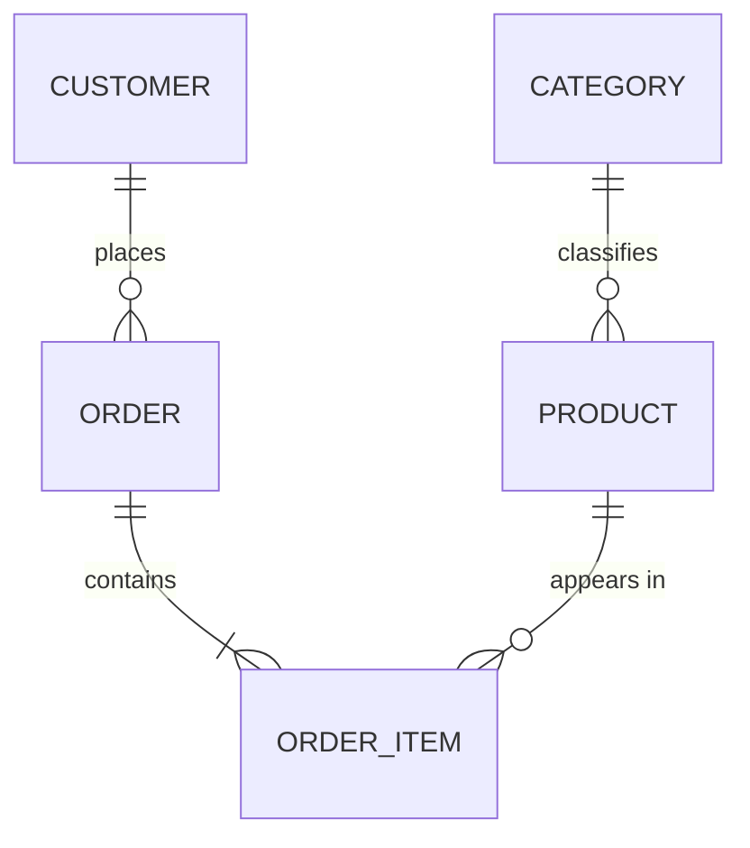

# RDBMS Data Modeling

**Requirements do not become DDL in one step.** Build the conceptual model, get it confirmed,
derive the logical model and normalize it, then — once the RDBMS is chosen — produce the
physical model and migration SQL.

Skipping the early stages is what produces schemas that churn: business concepts get missed,
and every missed concept becomes a migration later.

## When to Activate

- Designing tables for a new feature or service
- Authoring or reviewing an ERD
- Deciding a normalization, generalization, or denormalization tradeoff
- Two entities look like near-duplicates and you are unsure whether to merge them
- Planning a schema migration's target shape
- Choosing PK type, relationship cardinality, or soft-delete strategy

## Gate: How Much Rigor Does This Need?

Judge by the cost of a data error, then say which stages you are running.

| Domain | Stages |
|---|---|
| **Payments, inventory, permissions, contracts, ledgers, audit** | All three, with confirmation between each. Data errors here are expensive and often irreversible |
| Ordinary product features (content, profiles, settings, tracking) | All three, but conceptual and logical can be brief — a few lines and a compact ERD |
| Personal tool, throwaway script, single-user utility | Conceptual and logical may collapse into one short pass. Say that you compressed them |

Never skip a stage silently. If you compress, state it in one line so the user can object.

## Stage 1 — Conceptual Model

**Question: what does this system manage?**

Produce:

- The core business concepts
- The relationships between them
- The terms the *users* use, not database terms

Exclude entirely: columns, data types, keys, indexes, and the DB product.

Keep it to a few sentences or a small Mermaid diagram:

```
A customer places orders. An order contains one or more products.
A product belongs to a category.
```



While listing concepts, watch for **generalization candidates**: two or more concepts whose
base attributes are largely the same are probably one concept with variants. Flag them here as
a question — "are corporate customer and individual customer both kinds of customer?" — and
resolve the structure in Stage 2.

**→ Confirmation gate.** Present the concepts and the vocabulary, then ask whether anything is
missing or named wrong. Wait for the answer. Terminology corrections are cheapest here and
most expensive after the DDL exists.

Ask specifically about what tends to be missed: lifecycle states, who owns what, whether
history must be retained, and any concept the user mentioned in passing but you did not model.

## Stage 2 — Logical Model

**Question: what is the data structure?** Still no DB product.

Produce:

- Entities and their attributes
- Primary keys and foreign keys
- Relationships with cardinality (1:1, 1:N, N:M — resolve N:M into a junction entity)
- Required (`NOT NULL`) and unique attributes
- **3NF normalization, then the BCNF check on every entity**
- **The generalization check on every entity pair** — merge what shares its base attributes

Exclude: engine-specific data types, indexes, partitioning, storage.

Use generic types at this stage — *integer*, *text*, *decimal*, *timestamp*, *boolean* — not
`bigint unsigned` or `timestamptz`. Those belong to Stage 3.

Read `references/normalization.md` for the per-normal-form rules, the BCNF check procedure,
and the denormalization bar. Emit the BCNF check block for every entity, including the ones
where the answer is "none".

### Generalization — Merge What Shares Its Base Attributes

Normalization and generalization pull in opposite directions and you need both. Normalization
**splits** a table by functional dependency; generalization **merges** entities whose base
attributes are substantially the same into a supertype with subtypes.

Run this check after normalizing: for every pair of entities, ask whether they share most of
their base attributes.

**Generalize when all of these hold:**

- The shared attributes are the *substance* of both entities, not incidental
- Both participate in the same relationships (both are referenced the same way)
- Most business flows treat them uniformly, with only a few branching on type

```
Before:  CorporateCustomer(name, contact, tax_id, credit_limit)
         IndividualCustomer(name, contact, birth_date)

After:   Customer(customer_id, customer_type, name, contact)     ← supertype
         CorporateCustomerDetail(customer_id, tax_id, credit_limit)
         IndividualCustomerDetail(customer_id, birth_date)
```

**Keep them separate when any of these hold:**

- The overlap is only bookkeeping columns — `name`, `created_at`, and `updated_at` in common is
  not similarity
- The subtypes participate in disjoint relationships
- Their lifecycles differ (one is immutable, the other is edited; one is retained, the other purged)
- There are exactly two subtypes sharing one or two attributes — the supertype buys nothing

**Do not over-generalize.** Two failure modes cost more than the duplication they removed:

- A supertype so abstract that every meaningful column is nullable — you have traded database
  constraints for application checks
- An entity/attribute/value table (`entity`, `attr_name`, `attr_value`) — this discards typing,
  constraints, and the query planner's ability to help. It is not generalization, it is giving
  up on the schema

Record the decision per candidate pair: `generalized` with the supertype named, or `kept
separate` with which condition applied.

**→ Confirmation gate.** Present the ERD, the normalization steps, the BCNF results, and any
generalization decisions. Ask whether the keys, cardinalities, and subtype structure match the
business rules. Wait for the answer.

## Stage 3 — Physical Model

**Gate: the target RDBMS must be confirmed before any DDL.** The dialect and the applicable
guideline both depend on it.

The logical model is what makes this choice answerable — you now know the entity count, the
relationships, and the expected volumes. If the engine is undecided, use `db-select` now (it
also covers scale tier and three-year cost). Do not pick on the user's behalf.

If the engine is decided but unstated, ask:

> The logical model is ready. Which RDBMS is this targeting?
> 1. **Aurora MySQL** (AWS, MySQL-compatible)
> 2. **MySQL Community** (8.4 LTS+)
> 3. **Aurora PostgreSQL** (AWS, PostgreSQL-compatible)
> 4. **PostgreSQL Community** (16.7+)

If repo files already answer it (`docker-compose.yml`, `alembic.ini`, `flyway.conf`,
`prisma/schema.prisma`, `DATABASE_URL` in `.env`), confirm instead of asking cold: "The repo
looks like `<DB>`. Correct?"

Then produce:

- Table and column names per `rdbms-naming` — `snake_case`, singular tables, lowercase-prefix
  constraints and indexes (`pk_` / `fk_` / `uq_` / `chk_` / `idx_` / `ftx_`). The uppercase
  `_IDX` suffix is retired; it breaks under PostgreSQL case-folding
- Engine-specific data types, with PK type sized to the expected row count
- Constraints: PK, UNIQUE, CHECK, and NOT NULL. Logical FKs only — document the reference
  target in a `COMMENT`
- `created_at` on every table; `updated_at` on every mutable table (skip for append-only logs)
- Soft delete via `is_active` plus a composite index (MySQL) or partial index (PostgreSQL)
- Indexes driven by actual WHERE / JOIN / ORDER BY columns. Composite order is
  equality → sort → range (see `<engine>-guideline/index-and-query.md`)
- Partitioning and retention for log and history tables — monthly is the default cadence
- Migration SQL, ordered, with the rollout considerations from `database-migrations`

If Stage 2 produced a supertype/subtype structure, choose its physical mapping here — the
tradeoff is about constraints and query shape, so it belongs to the physical model:

| Strategy | Use when | What it costs |
|---|---|---|
| **Single table + discriminator column** | Subtypes differ by only a few attributes, and most queries span all subtypes | Subtype-specific columns must be nullable, so `NOT NULL` can no longer enforce them. Recover it with a `CHECK` on the discriminator: `CHECK (customer_type <> 'CORPORATE' OR tax_id IS NOT NULL)` |
| **Supertype table + one table per subtype** | Subtypes carry many distinct attributes, and queries usually target one subtype | A join for the full picture. Subtype PK is also an FK to the supertype; enforce exclusivity in the application (logical FK policy) |
| **One table per concrete subtype, no supertype table** | Subtypes are almost never queried together | Shared attributes are duplicated, and cross-subtype queries need `UNION ALL`. Shared relationships become awkward — usually the wrong choice when anything references the supertype |

Default to the supertype + subtype tables when the subtype attributes are substantial, and to
the single table with `CHECK` constraints when they are not. Say which one you picked and why.

Finally, propose sample data and a constraint test — the smallest inserts that prove the keys,
uniqueness, check constraints, and any subtype rules behave as intended.

### DB-to-Guideline Mapping

| Target | Apply | Key rules |
|---|---|---|
| Aurora MySQL / MySQL Community | `mysql-guideline` | InnoDB + utf8mb4, `bigint unsigned AUTO_INCREMENT`, `datetime` + `ON UPDATE CURRENT_TIMESTAMP`, `json`, logical FKs |
| Aurora PostgreSQL / PostgreSQL Community | `postgres-guideline` | `GENERATED ALWAYS AS IDENTITY`, `timestamptz`, `boolean`, `jsonb`, schema separation (`app`/`log`/`ref`), partial indexes, RLS |

Aurora variants follow the base guideline plus:

- **Aurora MySQL** — Writer/Reader split; avoid excessive indexes that slow writes; assume
  `FOR UPDATE` runs against the Writer endpoint
- **Aurora PostgreSQL** — Extension availability is limited (`pg_partman`, `pg_cron` may be
  restricted); plan scripted partitioning as a fallback
- **Both** — Size pools against RDS Proxy or app-side pools; account for IAM authentication
  when designing DB users; treat log tables as candidates for S3 Export or partition-and-drop

## Normalization Policy

**3NF is the requirement. BCNF is a check, then an option. Denormalization needs a
measurement.** Full rules in `references/normalization.md`.

| Level | Status | Rule |
|---|---|---|
| 1NF → 3NF | **Required** | The baseline for any OLTP schema. Not negotiable |
| BCNF | **Checked, then optional** | Test every table for a determinant that is not a superkey. Decompose when that determinant can actually produce an update, insert, or delete anomaly |
| Stay at 3NF | **Permitted exception** | When BCNF decomposition cannot preserve functional dependencies, or explodes the join count for normal queries. Record which one applied |
| Denormalization | **Requires evidence** | Only after a performance problem has been *measured*. Record the evidence and the synchronization mechanism |

Normalization and ACID solve different problems and neither substitutes for the other:

- **ACID** is how a transaction handles data safely — atomicity, consistency, isolation, durability.
- **Normalization** is how the schema avoids redundancy and update anomalies.

A fully normalized schema on a non-transactional store still corrupts under concurrent writes;
a transactional store with a denormalized schema still drifts out of sync. Assume an
ACID-capable engine (both MySQL/InnoDB and PostgreSQL are) and normalize on top of it.

Do not denormalize while designing something new. Denormalization answers a measured problem
in a running system — with no measurement, the deliverable is the normalized design.

## Deliverable Format

One section per stage, delivered in order, each stopping at its gate.

```
STAGE 1 — Conceptual model
  Rigor:      all three stages | compressed (and why)
  Concepts:   <business concepts and the user-facing terms>
  Relations:  <text or Mermaid>
  → Confirm: anything missing or misnamed?

STAGE 2 — Logical model
  ERD:            <entities, attributes, keys, cardinality>
  Required/unique: <NOT NULL and UNIQUE attributes>
  Normalization:  1NF result / 2NF violations + resolution / 3NF violations + resolution
  BCNF check:     one block per entity — FDs, violation or "none", decision, reason
  Generalization: per candidate pair — generalized (supertype named) | kept separate (why)
  → Confirm: do the keys, cardinalities, and subtype structure match the business rules?

STAGE 3 — Physical model
  Target DB:      <name and version, and how it was confirmed>
  Subtype mapping: <strategy and why — only if Stage 2 produced a supertype>
  DDL:            <CREATE TABLE + constraints in the correct dialect>
  Indexes:        <with the query each one serves>
  Partitioning:   <decision for log/history tables>
  Migration:      <ordered SQL + rollout notes>
  Sample data:    <smallest inserts that exercise the constraints>
  Checklist:      <verified below>
```

## Checklist

- [ ] Rigor level stated; any compressed stage called out explicitly
- [ ] Stage 1 confirmed by the user before Stage 2 began
- [ ] Stage 2 confirmed by the user before any DDL was written
- [ ] Target DB confirmed before Stage 3
- [ ] Logical model used generic types, not engine-specific ones
- [ ] 1NF: no repeating groups, no multi-value columns
- [ ] 2NF: no partial dependencies on composite PKs
- [ ] 3NF: no transitive dependencies between non-key columns
- [ ] BCNF check run on **every** entity, with the result stated (including "none")
- [ ] Each BCNF violation either decomposed, or kept at 3NF with the exception named
      (dependency preservation or join cost)
- [ ] Generalization checked: entity pairs sharing their base attributes either generalized
      into a supertype, or kept separate with the reason given
- [ ] No supertype where every meaningful column ended up nullable; no entity/attribute/value table
- [ ] Subtype physical mapping chosen and justified, with `CHECK` constraints recovering any
      `NOT NULL` lost to the single-table strategy
- [ ] No denormalization without a measurement, the alternatives already tried, and a stated
      synchronization mechanism
- [ ] Every denormalized column carries its rationale and sync mechanism in a `COMMENT`
- [ ] PK type matches expected row count (tinyint / smallint / int / bigint)
- [ ] No physical FK constraints; logical FKs documented in `COMMENT`
- [ ] `created_at` on every table; `updated_at` on every mutable table
- [ ] Soft-delete tables use `is_active` with the right index strategy per engine
- [ ] Naming follows `rdbms-naming`: snake_case, singular tables, lowercase-prefix
      indexes/constraints, boolean `is_`/`has_`, time columns `created_at`/`updated_at`
- [ ] Engine-correct types (MySQL: `datetime`, `json`, `tinyint(1)`; PostgreSQL:
      `timestamptz`, `jsonb`, `boolean`)
- [ ] Partitioning decision made for log and history tables
- [ ] Composite index order: equality → sort → range
- [ ] Sample data and constraint test proposed

## Anti-Patterns (Fix on Sight)

| Anti-pattern | Replacement |
|---|---|
| Requirements straight to `CREATE TABLE` | Conceptual → logical → physical, with gates |
| Engine types in the logical model | Generic types until Stage 3 |
| Near-duplicate tables sharing their base attributes | Generalize into a supertype with subtypes |
| Supertype where every meaningful column is nullable | Split into subtype tables, or add `CHECK` per discriminator value |
| Entity/attribute/value table | Real columns; `jsonb`/`json` only for non-queried config |
| Multi-value storage via CSV or pipe delimiters | Separate N:M table |
| `'Y'` / `'N'` string flags | MySQL `tinyint(1)` / PostgreSQL `boolean` |
| `timestamp` without timezone (PostgreSQL) | `timestamptz` |
| Habitual `varchar(255)` (PostgreSQL) | `text` |
| Natural key as PK when the key changes | Surrogate PK + `UNIQUE` constraint |
| Physical FK constraints | Logical FKs + application-level validation |
| Standalone `is_active` index | Composite index (MySQL) / partial index (PostgreSQL) |
| `OFFSET` pagination on large log tables | Cursor / keyset pagination |
| An index on every column | Minimal indexes driven by real query patterns |

## Related

- `db-select` — pick the engine, scale tier, and cost position at the Stage 3 gate
- `rdbms-naming` — naming and data-type conventions (single source of truth)
- `references/normalization.md` — per-normal-form rules, BCNF procedure, denormalization bar
- `mysql-guideline` — and its `mysql-guideline/schema-design.md`,
  `mysql-guideline/index-and-query.md`, `mysql-guideline/partitioning.md`,
  `mysql-guideline/operations.md`
- `postgres-guideline` — and its `postgres-guideline/schema-design.md`,
  `postgres-guideline/index-and-query.md`, `postgres-guideline/partitioning.md`
- `rdbms-review` — review an existing schema or query rather than designing a new one
- `database-migrations` — rolling the design out safely against a live database

---

**Remember**: conceptual model first and confirmed, then the logical model normalized to 3NF
with the BCNF check run on every entity, and only then the physical model in a confirmed
dialect. Denormalize only against a measurement, with the synchronization mechanism written
down.
